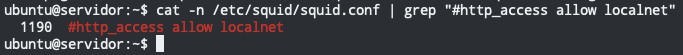
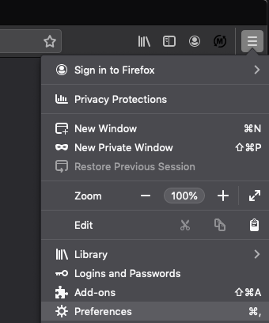

# Tabla de Contenidos


# Pre-requisitos

<details>
  <summary>Click aqui para ver los pre-requistos</summary>
  
## Multipass


[Multipass](https://multipass.run) proporciona una interfaz de línea de comandos para iniciar, administrar y, en general, jugar con instancias 
de Linux. La descarga de una imagen fresca lleva unos segundos, y en cuestión de minutos una VM puede estar en 
funcionamiento.

[Multipass](https://multipass.run) es un software gratuito desarrollado por Ubuntu que permite instalar maquinas virtuales de manera similar
a que si las tuvieramos en un [container](https://www.docker.com).
Las ventajas de Multipass a comparacion de las clasicas maquinas virtuales es basicamente que no se necesita un gran
equipo para poder instancias de ubuntu.
Cuando se habla de una instancia se hace referencia a una imagen que contiene cierto sistema operativo.

### Instalando Multipass

El siguiente link lleva a la descarga de un ejecutable desde el sitio oficial:

- :link: [Link de descarga](https://github.com/canonical/multipass/releases/download/v1.2.1/multipass-1.2.1%2Bwin-win64.exe)

### Habilitando Hyper-V en Windows

Para poder correr cualquier maquina virtual en Windows tenemos que habilitar `Hyper-V`, que por default viene deshabilitado.

Para poder habilitarlo basta con abrir Windows Power Shell (como Administrador), escribir el siguiente comando y reiniciar:

```bash
Enable-WindowsOptionalFeature -Online -FeatureName Microsoft-Hyper-V -All
```

> Si no sabe como abrir Windows Power Shell en Windows vea el siguiente video [como abrir Windows Power Shell en Windows](https://www.youtube.com/watch?v=doUhN9YwZ6U)

</details>

# Instalando la maquina virtual

Para instalar la maquina virtual lo haremos a travez de `multipass`, lo cual nos creara una instancia de ubuntu
de manera muy sencilla a la cual podemos acceder muy facilmente y sin necesitar gran cantidad de recursos de nuestro
sistema.

## Creando el servidor

Con el siguiente comando crearemos el servidor en una VM de ubuntu con version 18.04

```bash
multipass launch bionic --name servidor
```

<details>
  <summary>Click aqui para ver la salida del comando anterior</summary>
  
  

</details>


## Instalando paquetes en el servidor

Una vez creado el servidor, procederemos a instalar paquetes para poder crear nuestro servidor proxy, para eso tendremos
que estar dentro del servidor antes de poder instalar cualquier paquete.

Inserta el siguiente comando en la terminal para poder entrar al servidor

````bash
multipass shell servidor
````

<details>
  <summary>Click aqui para ver la salida del comando anterior</summary>
  
  

</details>

Una vez dentro del servidor procederemos a instalar los paquetes necesarios

Inserta el siguiente comando para actualizar los paquetes que ya contiene nuestro servidor

```bash
sudo apt update -y && sudo apt upgrade -y
```

<details>
  <summary>Click aqui para ver la salida del comando anterior</summary>
  
  

</details>

Inserta el siguiete comando para instalar el servidor proxy `squid`

```bash
sudo apt install vim squid -y
```

<details>
  <summary>Click aqui para ver la salida del comando anterior</summary>
  
  

</details>

Inserta el siguiente comando para eliminar los paquetes innecesarios del servidor

````bash
sudo apt autoremove -y
````

<details>
  <summary>Click aqui para ver la salida del comando anterior</summary>
  
  

</details>

Inserta el siguiente comando para reiniciar el servidor

```bash
sudo reboot
```

<details>
  <summary>Click aqui para ver la salida del comando anterior</summary>
  
  

</details>

Inserta el siguiente comando para forzar el inicio del servidor con `multipass`

````bash
multipass start servidor
````

<details>
  <summary>Click aqui para ver la salida del comando anterior</summary>
  
  

</details>

## Configurando Squid en el servidor

Primeramente hay que entrar al servidor con el siguiente comando:

````bash
multipass shell servidor
````

<details>
  <summary>Click aqui para ver la salida del comando anterior</summary>
  
  

</details>

Una vez dentro procedermos a escribir el siguiete comando en terminal para ver el estado del servidor proxy `Squid`

````bash
sudo systemctl status squid
````

> Es muy importante que la salida del comando anterior sea algo muy similar a la imagen de abajo, de lo contrario no
> podras proseguir con los pasos siguientes.

<details>
  <summary>Click aqui para ver la salida del comando anterior</summary>
  
  

</details>


Escribe el siguiente comando para copiar el archivo original de configuracion de `Squid`, en pocas palabras hacer un
respaldo

````bash
sudo cp /etc/squid/squid.conf{,.orginal}
````

### Configurando la Autenticacion

Squid cuenta con varios metodos de autenticacion, a continuacion configuraremos el tipo de autenticacion basica que
consta de un usuario y un password


Escribiremos el siguiente comando en la terminal, el cual creara un usuario llamado `test` con un password `123` que
estara encriptado en el archivo `/etc/squid/htpasswd`

````bash
printf "test:$(openssl passwd -crypt '123')\n" | sudo tee -a /etc/squid/htpasswd
````

<details>
  <summary>Click aqui para ver la salida del comando anterior</summary>
  
  

</details>

Ahora procederemos a buscar la linea en la cual esta ubicada el siguiente parrafo `#http_access allow localnet`
en el archivo de configuracion de `Squid` ubicado en `/etc/squid/squid.conf`

````bash
cat -n /etc/squid/squid.conf | grep "#http_access allow localnet"
````

<details>
  <summary>Click aqui para ver la salida del comando anterior</summary>
  
  

</details>


Teniendo en cuenta la linea del comando anterior, abrimos el archivo de configuracion `/etc/squid/squid.conf` con el
editor `vim` y buscaremos esa linea en particular

````bash
sudo vim /etc/squid/squid.conf
````

<details>
  <summary>Click aqui para ver la salida del comando anterior</summary>
  
  

</details>


Teniendo el archivo abierto insertaremos las siguientes lineas de codigo inmediatamente debajo del texto `# INSERT YOUR OWN RULE(S) HERE TO ALLOW ACCESS FROM YOUR CLIENTS`

````text
acl web_prohibidas dstdomain "/etc/squid/web_prohibidas.txt"
acl palabras_prohibidas url_regex "/etc/squid/palabras_prohibidas.txt"
auth_param basic program /usr/lib/squid3/basic_ncsa_auth /etc/squid/htpasswd
auth_param basic realm proxy
acl authenticated proxy_auth REQUIRED
````

De igual manera inmediatamente despues del texto `http_access allow localhost` insertamos las siguientes lineas

````text
http_access deny web_prohibidas
http_access deny palabras_prohibidas
http_access allow authenticated
````

<details>
  <summary>Click aqui para ver la salida del comando anterior</summary>
  
  

</details>

> Nota: el orden es muy importante, de manera contrario no funcionara el servidor proxy adecuadamente!


Ahora crearemos los archivos `web_prohibidas.txt` y `palabras_prohibidas.txt` que como su nombre lo infiere, aqui
se pondran todas aquellas webs a las que no queremos que los usuarios tengan acceso asi mismo como palabras especificas
para bloquear sitios indeseados.


Ejemplo para bloquear `facebook.com` y `youtube.com`

````bash
echo -ne ".facebook.com\n.youtube.com\n" | sudo tee /etc/squid/web_prohibidas.txt
````

<details>
  <summary>Click aqui para ver la salida del comando anterior</summary>
  
  

</details>


> Nota: los sitios a bloquear deben empezar con un punto al principio


Ejemplo para bloquear palabras claves en las URLs:

````bash
echo -ne "play\nsteam\n" | sudo tee /etc/squid/palabras_prohibidas.txt
````

<details>
  <summary>Click aqui para ver la salida del comando anterior</summary>
  
  

</details>


Ahora procederemos a reiniciar el servicio de `Squid` para que nuestros cambios realizados tomen efecto inmediato

````bash
sudo systemctl restart squid
````

<details>
  <summary>Click aqui para ver la salida del comando anterior</summary>
  
  

</details>

> Nota: este comando puede tardar un poco

Y para corroborar que todos nuestros cambios surtieron el efecto deseado, insertaremos el siguiente comando

````bash
sudo systemctl status squid
````

<details>
  <summary>Click aqui para ver la salida del comando anterior</summary>
  
  

</details>

> Nota: si la salida del comando anterior no es igual a la imagen, significa que algo tienes mal en la configuracion
> y no podras avanzar hasta que lo resuelvas

## Habilitando el firewall

Por defecto el firewall de Ubuntu viene deshabilitado, lo tendremos que habilitar para que trabaje en conjunto con
nuestro servidor proxy `Squid`


Insertamos el siguiente comando para habilitar el firewall

````bash
sudo ufw enable
````

<details>
  <summary>Click aqui para ver la salida del comando anterior</summary>
  
  

</details>


Insertamos el siguiente comando para permitir el uso de `Squid` en el firewall

````bash
sudo ufw allow 'Squid'
````

<details>
  <summary>Click aqui para ver la salida del comando anterior</summary>
  
  

</details>

Insertamos el siguiente comando para ver si `Squid` fue correctamente habilitado

````bash
sudo ufw status
````

<details>
  <summary>Click aqui para ver la salida del comando anterior</summary>
  
  

</details>

> Nota: si no tienes habilitado `Squid` en el firewall de Ubuntu no podras continuar hasta que lo habilites!


# Configurando tu navegador para usar proxy

En este punto `Squid` esta funcionado y solo queda configurar nuestro navegador para usar el servidor proxy,

Como pre-requisito tendras que descubrir cual es la ip del servidor con el siguiete comando

````bash
multipass ls
````

<details>
  <summary>Click aqui para ver la salida del comando anterior</summary>
  
  

</details>

> Nota: la ip del servidor la necesitaremos para configurarlas en los navegadores


Ve a la seccion acorde al navegador que tengas instalado en tu sistema


## Firefox

<details>
  <summary>Click aqui para ver la configuracion de Firefox</summary>
  
  1. Abrir las preferencias de `Firefox` como se muestra en la imagen a continuacion
  
  
  
  2. En el buscador insertar la palabra `proxy` y hacer click en la opcion de `Settings...`
  
  
  
  3. Selecciona "Manual proxy configuration" y pon la ip del servidor proxy (`Squid`) asi como el puerto como se muestra a continuacion
  
  
  
  4. Abre una nueva pestaña de firefox y notaras que te pedira credenciales, inserta las credenciales creadas anteriomente (User Name = test) (Password = 123)
  
  
  
  5. Trata de acceder a las web prohibidas o inserta una palabra prohibida para verificar el funcionamiento del servidor proxy
  
  
  

</details>

# Autores

- Humberto Israel Perez Rodriguez

# Fuentes:
- [How to install and configure squird proxy on ubuntu 18.04](https://linuxize.com/post/how-to-install-and-configure-squid-proxy-on-ubuntu-18-04/)
- [Instalación y configuración básica de Squid en Ubuntu 18.04](https://www.youtube.com/watch?v=vj00RVHGxFg)