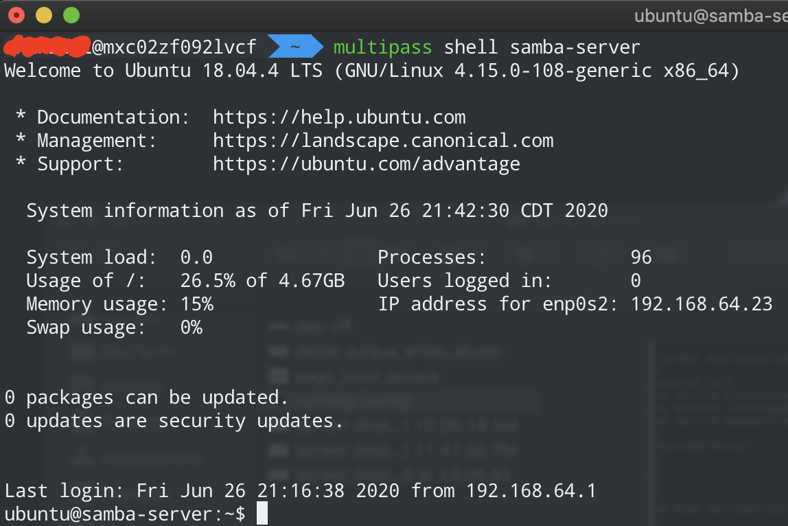
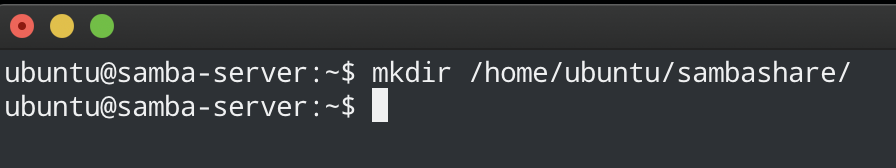
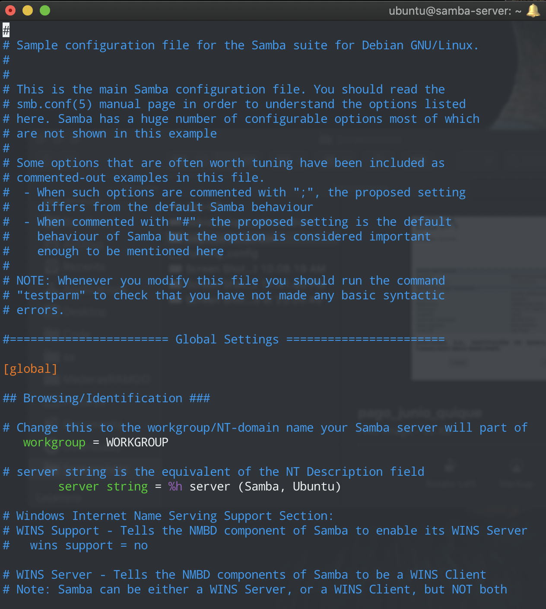
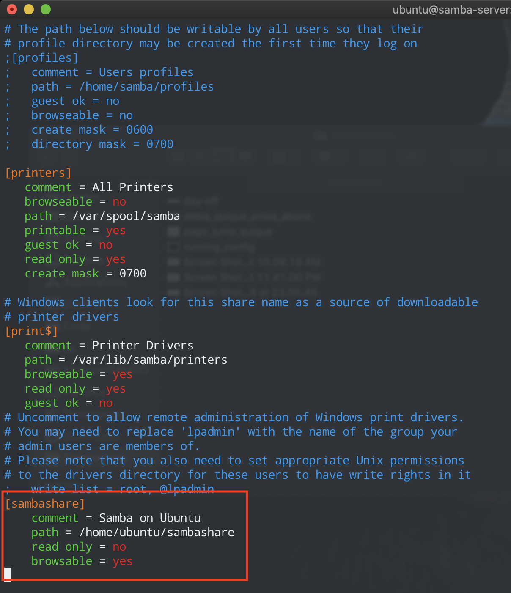
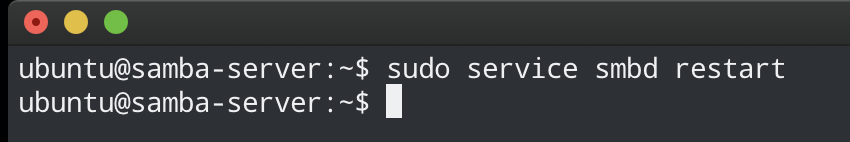

# Tabla de Contenidos


- [Pre-requisitos](#pre-requisitos)
    - [Multipass](#multipass)
- [Instalando la maquina virtual](#instalando-la-maquina-virtual)
    - [Creando el servidor](#creando-el-servidor)
    - [Instalando paquetes en el servidor](#instalando-paquetes-en-el-servidor)
    - [Instalando samba en el servidor](#instalando-samba-en-el-servidor)
    - [Configurando samba en el servidor](#configurando-samba-en-el-servidor)
- [Autores](#autores)
    
    
    
# Pre-requisitos

<details>
  <summary>Click aqui para ver los pre-requistos</summary>
  
## Multipass


[Multipass](https://multipass.run) proporciona una interfaz de línea de comandos para iniciar, administrar y, en general, jugar con instancias 
de Linux. La descarga de una imagen fresca lleva unos segundos, y en cuestión de minutos una VM puede estar en 
funcionamiento.

[Multipass](https://multipass.run) es un software gratuito desarrollado por Ubuntu que permite instalar maquinas virtuales de manera similar
a que si las tuvieramos en un [container](https://www.docker.com).
Las ventajas de Multipass a comparacion de las clasicas maquinas virtuales es basicamente que no se necesita un gran
equipo para poder instancias de ubuntu.
Cuando se habla de una instancia se hace referencia a una imagen que contiene cierto sistema operativo.

### Instalando Multipass

El siguiente link lleva a la descarga de un ejecutable desde el sitio oficial:

- :link: [Link de descarga](https://github.com/canonical/multipass/releases/download/v1.2.1/multipass-1.2.1%2Bwin-win64.exe)

### Habilitando Hyper-V en Windows

Para poder correr cualquier maquina virtual en Windows tenemos que habilitar `Hyper-V`, que por default viene deshabilitado.

Para poder habilitarlo basta con abrir Windows Power Shell (como Administrador), escribir el siguiente comando y reiniciar:

```bash
Enable-WindowsOptionalFeature -Online -FeatureName Microsoft-Hyper-V -All
```

> Si no sabe como abrir Windows Power Shell en Windows vea el siguiente video [como abrir Windows Power Shell en Windows](https://www.youtube.com/watch?v=doUhN9YwZ6U)

</details>

# Instalando la maquina virtual

Para instalar la maquina virtual lo haremos a travez de `multipass`, lo cual nos creara una instancia de ubuntu
de manera muy sencilla a la cual podemos acceder muy facilmente y sin necesitar gran cantidad de recursos de nuestro
sistema.

## Creando el servidor

Con el siguiente comando crearemos el servidor en una VM de ubuntu con version 18.04

```bash
multipass launch bionic --name servidor-samba
```

<details>
  <summary>Click aqui para ver la salida del comando anterior</summary>
  
  

</details>

## Instalando paquetes en el servidor

Una vez creado el servidor, procederemos a instalar paquetes para poder crear nuestro servidor proxy, para eso tendremos
que estar dentro del servidor antes de poder instalar cualquier paquete.

Inserta el siguiente comando en la terminal para poder entrar al servidor

````bash
multipass shell servidor-samba
````

<details>
  <summary>Click aqui para ver la salida del comando anterior</summary>
  
  

</details>

Una vez dentro del servidor procederemos a instalar los paquetes necesarios

Inserta el siguiente comando para actualizar los paquetes que ya contiene nuestro servidor

```bash
sudo apt update -y && sudo apt upgrade -y
```

<details>
  <summary>Click aqui para ver la salida del comando anterior</summary>
  
  

</details>

## Instalando samba en el servidor

````bash
sudo apt install samba -y
````

## Configurando samba en el servidor

<details>
  <summary>Click aqui para ver la configuracion de samba en el servidor</summary>

1 - Crear una carpeta para alojar los archivos compartidos de samba 

````bash
mkdir /home/ubuntu/sambashare/
````

<details>
  <summary>Click aqui para ver la salida del comando anterior</summary>
  
  
  
</details>  

2 - Editar el siguiente archivo de configuracion de samba

````bash
sudo vim /etc/samba/smb.conf
````

<details>
  <summary>Click aqui para ver la salida del comando anterior</summary>
  
  
  
</details>  

agregar al final del archivo las siguientes lineas:

````text
[sambashare]
    comment = Samba on Ubuntu
    path = /home/ubuntu/sambashare
    read only = no
    browsable = yes
````

<details>
  <summary>Click aqui para ver la salida del comando anterior</summary>
  
  
  
</details>  


3 - Reiniciar el servidor de Samba para que tengan efectos los cambios hechos

````bash
sudo service smbd restart
````

<details>
  <summary>Click aqui para ver la salida del comando anterior</summary>
  
  
  
</details>  


</details>


# Autores

- Humberto Israel Perez Rodriguez