# Tabla de Contenidos

- [Conectandose al servidor](#conectandose-al-servidor)
    - [Actualizando paquetes del servidor](#actualizando-paquetes-del-servidor)
    - [Instalando paquetes para el servicio FTP](#instalando-paquetes-para-el-servicio-ftp)
    - [Editando el archivo de configuracion de FTP](#editando-el-archivo-de-configuracion-de-ftp)
    - [Agregando un usuario al servicio FTP](#agregando-un-usuario-al-servicio-ftp)
    - [Restringiendo el directorio de FTP](#restringiendo-el-directorio-de-ftp)
    - [Permitir que Filezilla suba archivos al servidor](#permitir-que-filezilla-suba-archivos-al-servidor)
    - [Paso adicional (cambiando el directorio por default del usuario ftpuser)](#paso-adicional-cambiando-el-directorio-por-default-del-usuario-ftpuser)
- [Subiendo archivos al servidor con Filezilla](#subiendo-archivos-al-servidor-con-filezilla)

# Conectandose al servidor

Para todos los comandos posteriores tienes que estar dentro del servidor para poder ejecutarlos

````bash
ssh -i "<archivo>.pem" ubuntu@ip_servidor
````

## Actualizando paquetes del servidor

````bash
sudo apt update -y; sudo apt upgrade -y
````

> Nota: el comando anterior te mostrara dos ventanas en color rosa a las cuales solo le tienes que dar
> enter 

<details>
  <summary>Click aqui para ver la salida del comando anterior</summary>
  
  > Esta es la primera ventana que se mostrara
  
  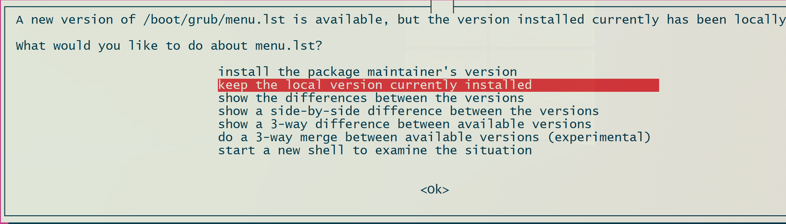
  
  
  > Esta es la segunda ventana que se mostrara
  
  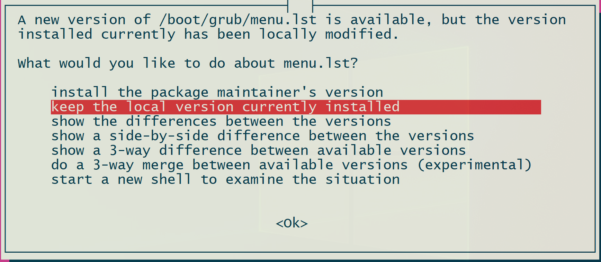

</details>

## Instalando paquetes para el servicio FTP

Los siguientes paquetes son necesarios para habilitar el servicio de FTP en el servidor

````bash
sudo apt install apache2 -y; sudo apt install vsftpd -y
````

<details>
  <summary>Click aqui para ver la salida del comando anterior</summary>
  
  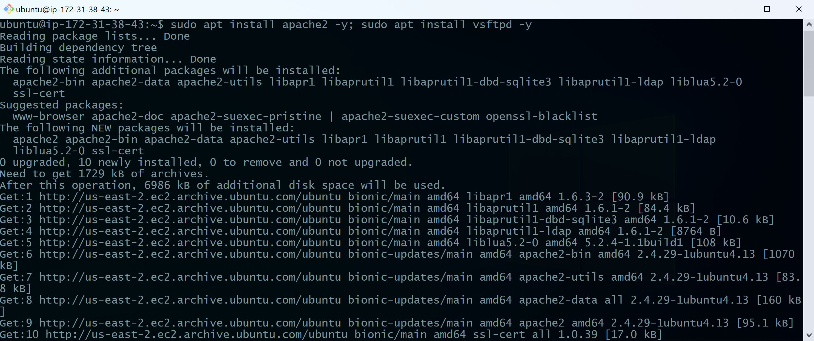
  
</details>

## Editando el archivo de configuracion de FTP

1 - Vamos a editar el archivo de configuracion `vsftpd.conf` ubicado en `/etc` con el siguiente comando:

````bash
sudo vim /etc/vsftpd.conf
````

2 - Al final del archivo insertamos las siguientes lineas

````text
pasv_enable=YES
pasv_min_port=1024
pasv_max_port=1048
pasv_address=<IP_SERVIDOR>
````

> Nota: tienes que remplazar la palabra "<IP_SERVIDOR>" por la ip del servidor


<details>
  <summary>Click aqui para ver la salida del comando anterior</summary>
  
  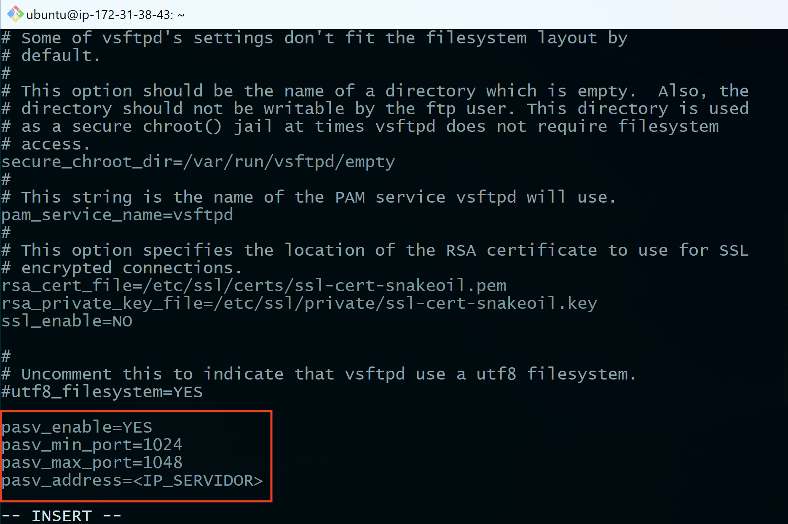
  
</details>

3 - Reiniciamos el servicio de FTP

````bash
sudo service vsftpd restart
````

<details>
  <summary>Click aqui para ver la salida del comando anterior</summary>
  
  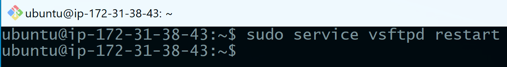
  
</details>

## Agregando un usuario al servicio FTP

````bash
sudo adduser ftpuser
````

> Nota: se te pedira ingresar un password para el usuario, despues de eso solo presiona enter para seleccionar los valores
> default 


<details>
  <summary>Click aqui para ver la salida del comando anterior</summary>
  
  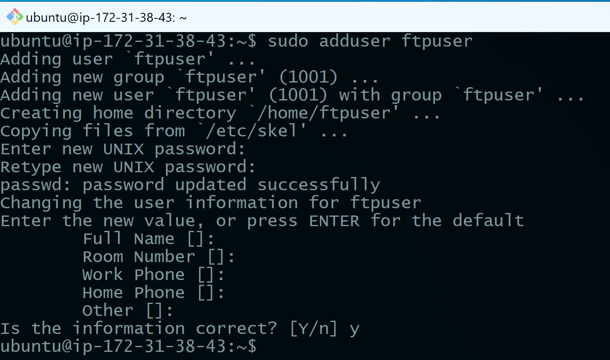
  
</details>

## Restringiendo el directorio de FTP

Por cuestiones de seguridad debemos restringir el acceso a solo la carpeta que queremos compartir con los siguientes pasos:

1 - Abrirmos el archivo de configuracion `vsftpd` del FTP

````bash
sudo vim /etc/vsftpd.conf
````

2 - Desconmentamos la linea `chroot_local_user=YES` y salvamos el archivo

<details>
  <summary>Click aqui para ver la salida del comando anterior</summary>
  
  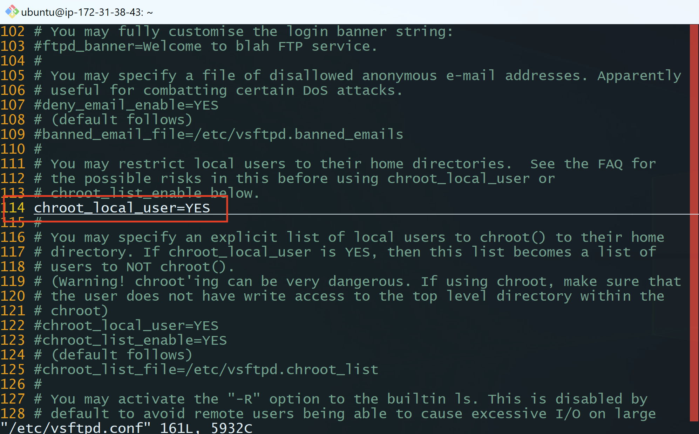
  
</details>


3 - Reiniciamos el servicio de FTP

````bash
sudo service vsftpd restart
````

<details>
  <summary>Click aqui para ver la salida del comando anterior</summary>
  
  
  
</details>

## Permitir que Filezilla suba archivos al servidor

Inserta los siguientes comandos en la terminal

````bash
echo 'allow_writeable_chroot=YES' | sudo tee -a /etc/vsftpd.conf
sudo sed -i 's|#write_enable=YES|write_enable=YES|g' /etc/vsftpd.conf
````

<details>
  <summary>Click aqui para ver la salida del comando anterior</summary>
  
  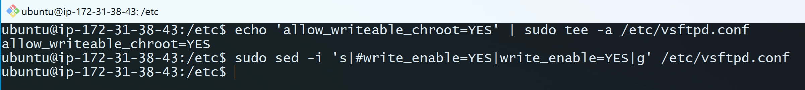
  
</details>

## Paso adicional (cambiando el directorio por default del usuario ftpuser)

Por default el directorio en el cual se subiran los archivos es `/home/ftpuser` lo cual no es conveniente,
si se requiere cambiar el directorio actual insertar los siguientes comados en la terminal:

````bash
sudo mkdir -p /var/www/html/ftpuser
sudo chown -R ftpuser:ftpuser /var/www/html/ftpuser
sudo usermod -d "/var/www/html/ftpuser" ftpuser
````

<details>
  <summary>Click aqui para ver la salida del comando anterior</summary>
  
  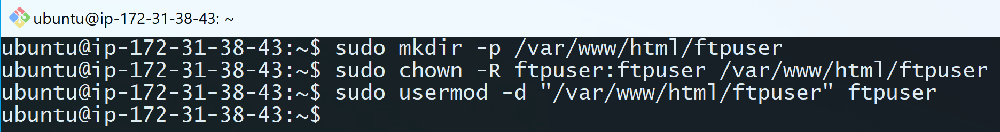
  
</details>


Posteriormente reiniciar el servicio FTP

````bash
sudo service vsftpd restart
````

<details>
  <summary>Click aqui para ver la salida del comando anterior</summary>
  
  
  
</details>

# Subiendo archivos al servidor con Filezilla

1 - Abrimos filezilla e insertamos las siguientes credenciales

````text
Host: <IP_SERVIDOR>
Username: ftpuser
Password: 123
````

> Nota: cambiar "<IP_SERVIDOR>" por la ip del servidor a conectarse


<details>
  <summary>Click aqui para ver un ejemplo</summary> 
    
  1 - Aparecera la siguiente ventana, solo da click en el boton de "OK"
  
  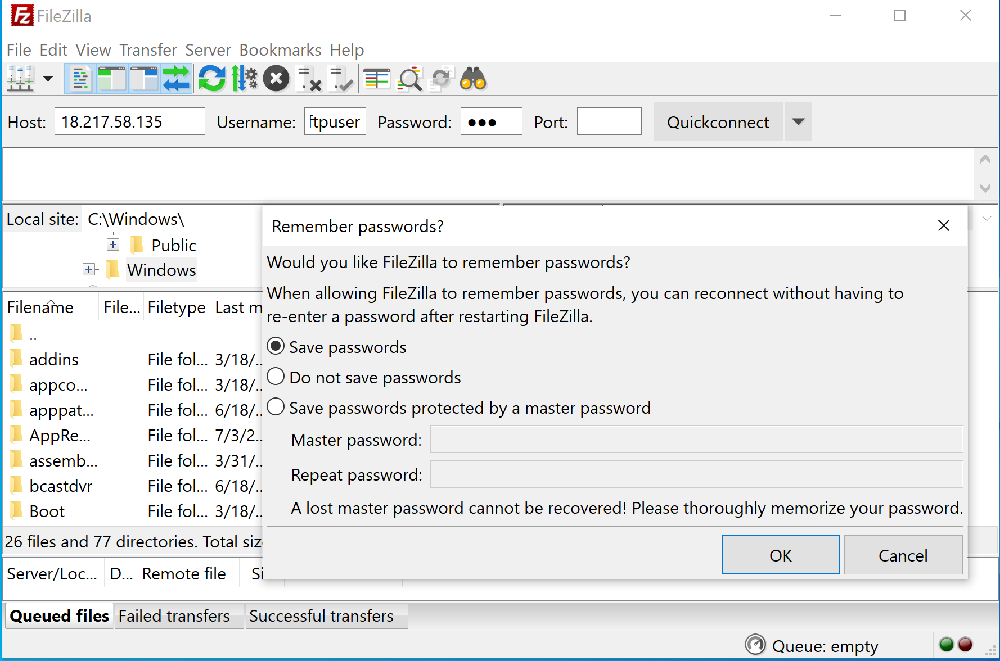
  
  2 - Aparecera la siguiente ventana, solo da click en el boton de "OK"
  
  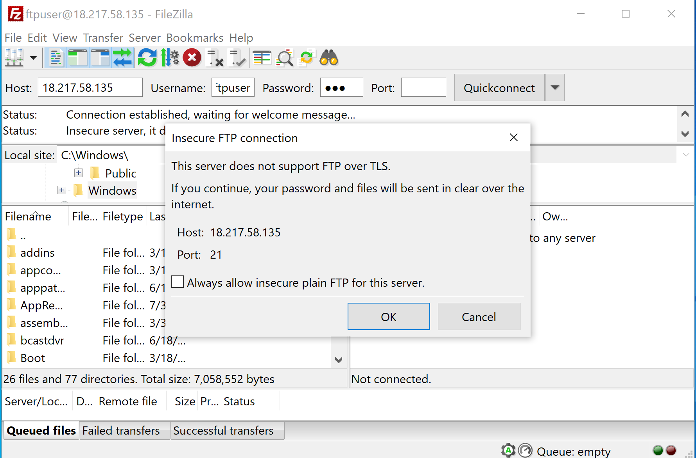 
  
</details>

2 - Si las credenciales son correctas, podras transferir archivos al servidor arrastrandolos hacia la parte derecha de la
pantalla de FileZilla

<details>
  <summary>Click aqui para ver un ejemplo</summary> 
   
  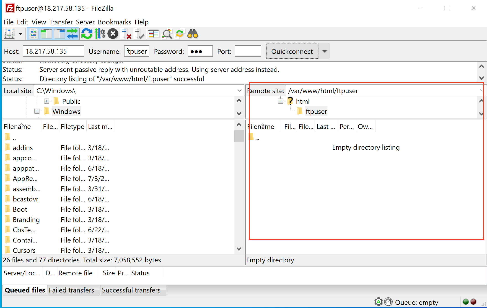 
  
</details>